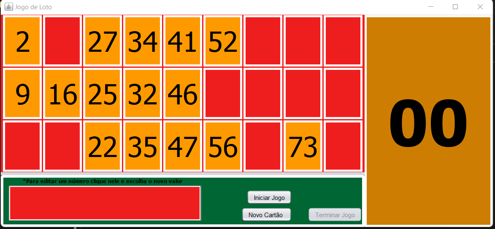

# Jogo do Loto

Jogos Loto(Ou Bingo) com interface gráfica
Este jogo é conectado por sockets, portanto pode ser jogado em computadores diferentes.

O Gestor deve iniciar o servidor para que os utilizadores possam conectar.

Interface Gráfica Jogador:

Interface Gráfica Gestor de Mesas:

